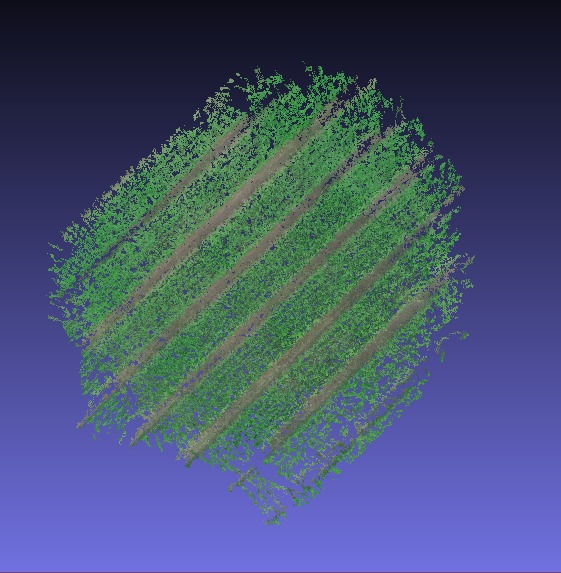
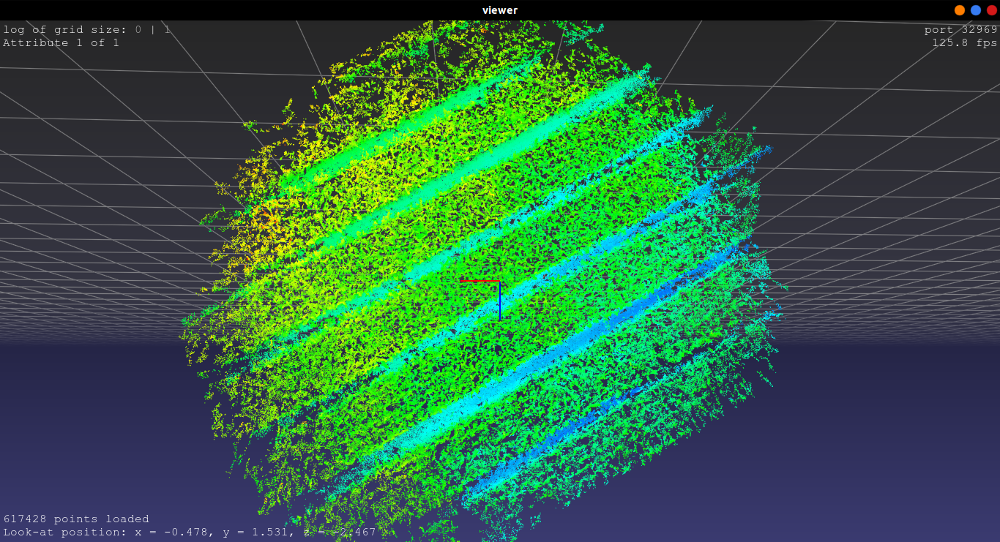

A scripting tool for estimating height and producing a 2D raster image output.

## Dependencies
The module depends on the following libraries:
+ Python 3.0+
+ Visualsfm mardy
+ Open3D
+ pptk
+ Numpy
+ Matplotlib

## Screenshots
The following pointcloud was tested on this script

It produced the following raster image:

## Features
+ Generates frames from the input video and constructs pointcloud.
+ Removes outliers from the pointcloud for accurate height estimation.
+ Estimates height of the pointcloud generated.
+ Outputs a 2D Raster Image according to a height scale.
