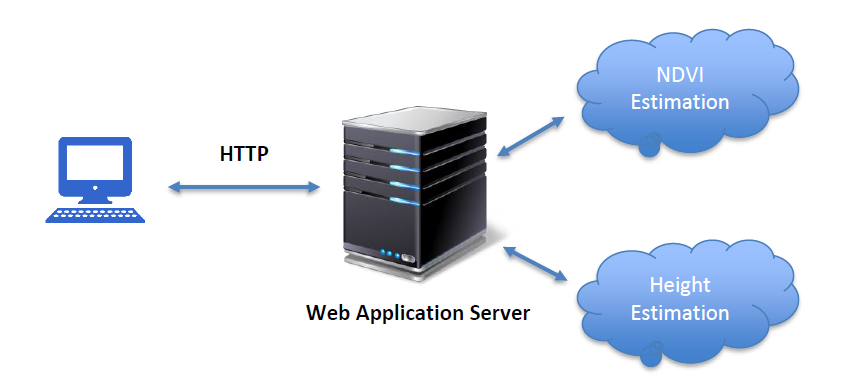

# Crop-Health-Analysis

## Introduction
A deep learning tool for analysing crop health. There are alot of factors that contribute to the health of crop, analysing a few important factors can give a good estimate of the crop health. We mainly focused on two factors:
+ `NDVI`
+ `Height
`
## Components
The components of the repo include:
+ Web Client
+ Unet-Ndvi
+ Height Estimation

## Web Cleint
The frontend of the application allowing users to interact with the tool with an intuitive and easy to use user interface.

To learn how to run the web application .

## Unet-Ndvi
The backend of the application and the core part of the application. The model estimates NDVI values using RGB imagery.

To learn more about the model .

## Height Estimation
This module is resposible for generating pointcloud and estimating height of crop.

To learn more about this module .
