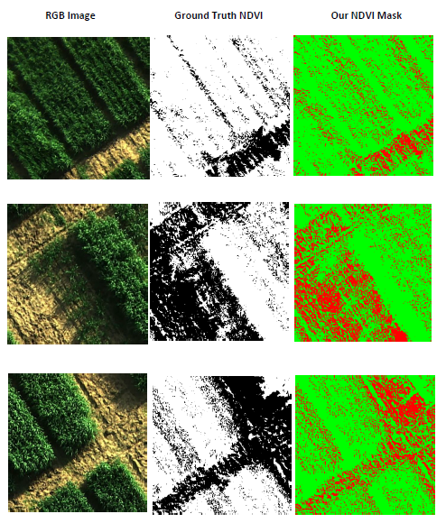

# NDVI Estimation Pipeline

## Introduction
Traditional crop health analysis involved ground surveying that needs to be done at different phenotypic stages which is error prone and the data is unreliable. Most recently the focus has been shifted towards precision agriculture, that uses UAVs mounted with multispectral cameras to do surveying and the results are then used to generate a health report using vegetation indices such as NDVI. Most vegetation indices use multispectral imagery to generate results, for example NDVI uses mainly Red and NIR bands. This method is not cost effective and the multispectral sensor has a lower spatial resolution compared to an RGB camera. In our proposed methodology, we have estimated the NDVI values using RGB imagery that provides a more cost-effective method using deep learning.

## Dataset
We have collected our own custom dataset by performing several breeding experiments at the National Agriculture Research Center (NARC), Islamabad, Pakistan.

**Download Link:** https://drive.google.com/file/d/1NrOjqKNzkoxhjgnTPbVzZLDL6_Qmdudq/view?usp=sharing

The dataset contains raw sensor data containing both RGB and NIR information. In order to isolate the bands execute,

```
python sensor_correction+GT_NDVI.py
```

## Data Augmentation
In order to generalize the model better we have used Keras's module called ImageDataGenerator in keras.preprocessing.image to do data augmentation.

See train.py and data.py for detail.

## Dependencies
This module depends on the following libaries:

* Python 2.7-3.7
* Tensorflow-gpu
* Keras >= 1.0
* OpenCV
* tifffile
* Matplotlib
* Flask

## Model Architecture
This deep neural network is implemented with Keras functional API, which makes it extremely easy to experiment with different interesting architectures.

Output from the network is a 512*512 which represents mask that should be learned. Sigmoid activation function makes sure that mask pixels are in [0, 1] range.


# How to run

## Training
In order to train the model from scratch, you need to download the dataset first, and after following the steps mentioned in Dataset section, create a directory "Data" and add separete directories for NIR and RGB images in Data directory. Then run the script,

```
python train.py
```

The model is trained for 5 epochs.

After 5 epochs, calculated accuracy is about **0.86**.

Loss function for the training is basically just a binary crossentropy.
## Pretrained Model:
If you want to finetune or perform inference on the pretrained model, we provide pre-trained weights of our model for direct inference.

**Download Link:** https://drive.google.com/file/d/10s4ikNGHhV7co4QYEjQPv-dNpuXB5Skx/view?usp=sharing

For inference run,

```
python train.py inference
```
## Results


## Flask Server
In addition, to that we have also provided an inference server built using flask that offers two routes for inference and then downloading the results, run

```
python server.py
```

The server listens for incomming HTTP requests containing RGB images on inference route:
```
http://127.0.0.1:5000/api/predict
```

After performing inference the results will be stored on the server and you can download the results using the following path,

```
http://127.0.0.1:5000/download/<path:path>
```

where path contains the name of files that you sent for inference.

## About Keras
Keras is a minimalist, highly modular neural networks library, written in Python and capable of running on top of either TensorFlow or Theano. It was developed with a focus on enabling fast experimentation. Being able to go from idea to result with the least possible delay is key to doing good research.

Use Keras if you need a deep learning library that:

allows for easy and fast prototyping (through total modularity, minimalism, and extensibility). supports both convolutional networks and recurrent networks, as well as combinations of the two. supports arbitrary connectivity schemes (including multi-input and multi-output training). runs seamlessly on CPU and GPU. Read the documentation Keras.io

Keras is compatible with: Python 2.7-3.5.
